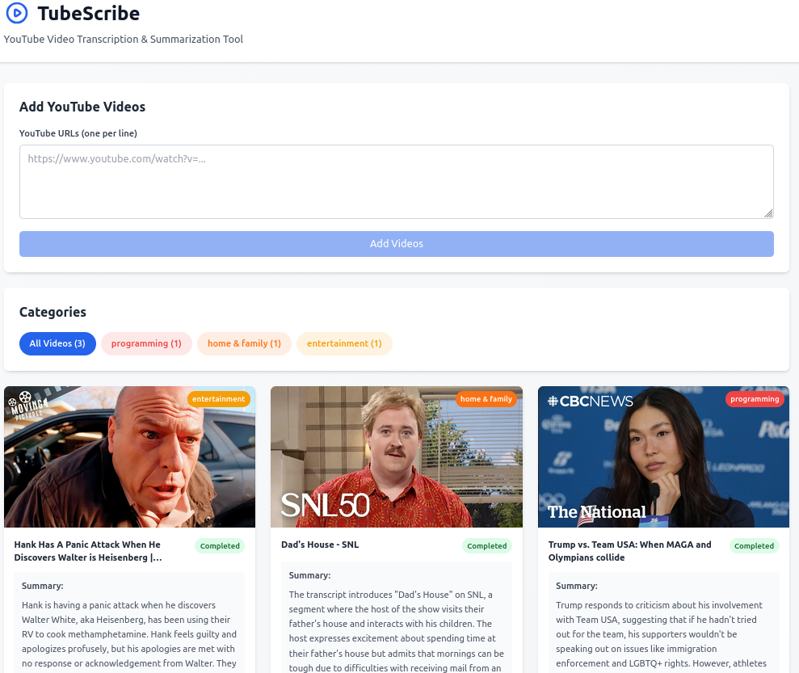

# TubeScribe

An agentic web application for automatically transcribing, summarizing, and categorizing YouTube videos using AI. Built with Python, Flask, LangChain, and React.



## Features

- **YouTube Video Processing**: Download and transcribe YouTube videos automatically
- **AI-Powered Summarization**: Generate concise summaries using local LLMs (via Ollama)
- **Smart Categorization**: Automatically categorize videos using AI analysis
- **Real-Time Progress Tracking**: Live status updates via WebSocket
- **Modern UI**: Responsive React frontend with Tailwind CSS
- **Video Library**: Persistent storage of all processed videos
- **Category Filtering**: Organize and filter videos by AI-generated categories

## Tech Stack

### Backend
- **Flask**: Lightweight web framework
- **Flask-SocketIO**: Real-time WebSocket communication
- **SQLAlchemy**: Database ORM
- **SQLite**: Database storage
- **yt-dlp**: YouTube video downloading
- **OpenAI Whisper**: Local speech-to-text transcription
- **LangChain**: AI/LLM orchestration
- **Ollama**: Local LLM inference

### Frontend
- **React 18**: UI library
- **Vite**: Build tool and dev server
- **Tailwind CSS**: Utility-first CSS framework
- **Axios**: HTTP client
- **Socket.io-client**: WebSocket client

## Architecture

```
tubescribe/
├── backend/
│   ├── api/              # API routes and WebSocket handlers
│   │   ├── routes.py     # REST API endpoints
│   │   └── ws.py         # WebSocket handlers
│   ├── models/           # Database models
│   │   └── database.py   # SQLAlchemy models
│   ├── services/         # Business logic
│   │   ├── youtube_service.py    # YouTube downloading
│   │   ├── transcribe_service.py # Whisper transcription
│   │   ├── summarize_service.py  # LLM summarization
│   │   └── categorize_service.py # AI categorization
│   ├── utils/            # Utilities
│   │   └── progress_tracker.py   # Progress tracking
│   ├── config.py         # Configuration
│   └── __init__.py       # Flask app factory
├── frontend/
│   ├── src/
│   │   ├── components/   # React components
│   │   │   ├── VideoCard.jsx
│   │   │   ├── VideoForm.jsx
│   │   │   ├── CategoryFilter.jsx
│   │   │   └── LoadingStep.jsx
│   │   ├── hooks/        # Custom React hooks
│   │   │   └── useVideos.jsx
│   │   ├── services/     # API service
│   │   │   └── api.js
│   │   ├── App.jsx       # Main app component
│   │   └── main.jsx      # Entry point
│   ├── package.json
│   └── vite.config.js
├── data/                 # Database and downloads
├── transcriptions/       # Cached transcriptions
├── app.py               # Flask entry point
├── requirements.txt     # Python dependencies
└── README.md           # This file
```

## Installation

### Prerequisites

- Python 3.9+
- Node.js 18+
- FFmpeg (for audio processing)
- Ollama (for local LLM inference)

### 1. Install FFmpeg

**Ubuntu/Debian:**
```bash
sudo apt update
sudo apt install ffmpeg
```

**macOS:**
```bash
brew install ffmpeg
```

**Windows:**
Download from [ffmpeg.org](https://ffmpeg.org/download.html)

### 2. Install and Configure Ollama

Download and install Ollama from [ollama.ai](https://ollama.ai).

Start Ollama server:
```bash
ollama serve
```

Pull a model (e.g., Llama 3):
```bash
ollama pull llama3
```

### 3. Clone the Repository

```bash
git clone <repository-url>
cd tubescribe
```

### 4. Backend Setup

Create a virtual environment:
```bash
python -m venv venv
source venv/bin/activate  # On Windows: venv\Scripts\activate
```

Install dependencies:
```bash
pip install -r requirements.txt
```

Configure environment variables:
```bash
cp .env.example .env
```

Edit `.env` to configure your settings (default values should work for local development).

### 5. Frontend Setup

Navigate to frontend directory:
```bash
cd frontend
```

Install dependencies:
```bash
npm install
```

## Usage

### Running the Application

#### Terminal 1 - Backend

From the project root:
```bash
source venv/bin/activate  # Activate virtual environment
python app.py
```

The Flask backend will start on `http://localhost:5000`

#### Terminal 2 - Frontend

From the `frontend` directory:
```bash
npm run dev
```

The React frontend will start on `http://localhost:5173`

### Using the Application

1. Open your browser and navigate to `http://localhost:5173`
2. Enter one or more YouTube URLs (one per line)
3. Click "Add Videos" to start processing
4. Watch as videos are processed with real-time progress updates
5. Once complete, view AI-generated summaries and categories
6. Filter videos by category using the category filter
7. Click "Watch on YouTube" to view the original video

### Processing Pipeline

For each video, TubeScribe performs the following steps:

1. **Download Audio**: Extracts audio from YouTube video
2. **Transcribe**: Converts speech to text using Whisper
3. **Summarize**: Generates a concise summary using LangChain and Ollama
4. **Categorize**: Analyzes content and assigns a category
5. **Store**: Saves all data to SQLite database

## API Endpoints

### Videos

- `GET /api/videos` - Get all videos (optionally filter by category)
- `GET /api/videos/{id}` - Get specific video
- `POST /api/videos` - Add new videos
- `DELETE /api/videos/{id}` - Delete a video

### Categories

- `GET /api/categories` - Get all categories
- `POST /api/categories` - Create a new category

### Stats

- `GET /api/stats` - Get application statistics

## WebSocket Events

### Client → Server

- `join_video` - Join a video's progress updates
- `leave_video` - Leave a video's progress updates
- `subscribe_all` - Subscribe to all video updates

### Server → Client

- `video_progress` - Progress update for a specific video
- `all_updates` - All video updates

## Configuration

Edit `.env` to configure the application:

```env
# Ollama Configuration
OLLAMA_BASE_URL=http://localhost:11434
OLLAMA_MODEL=llama3                    # Model for summarization
OLLAMA_CATEGORY_MODEL=llama3           # Model for categorization

# Whisper Configuration
WHISPER_MODEL=base                    # tiny, base, small, medium, large

# Flask Configuration
FLASK_PORT=5000
FLASK_HOST=0.0.0.0
FLASK_DEBUG=True

# CORS Configuration
CORS_ORIGINS=http://localhost:5173,http://localhost:3000
```

## Troubleshooting

### Ollama Connection Issues

If Ollama fails to connect:

```bash
# Check if Ollama is running
ollama list

# Restart Ollama
pkill ollama
ollama serve
```

### Whisper Model Not Found

Whisper will download the model automatically on first use. For faster transcription, you can manually download:

```bash
whisper.download_model("base")
```

### FFmpeg Not Found

If transcriptions fail with FFmpeg errors:

```bash
# Verify FFmpeg installation
ffmpeg -version
```

### Database Issues

Reset database (warning: deletes all data):

```bash
rm data/tubescribe.db
python app.py  # Database will be recreated
```

### Port Conflicts

If ports are already in use, modify in `.env`:

```env
FLASK_PORT=5001  # Change backend port
```

## Development

### Project Structure

- **Backend**: Flask-based REST API with WebSocket support
- **Frontend**: React SPA with Vite for fast development
- **Database**: SQLite for single-user applications
- **AI Services**: Local inference with Whisper and Ollama

### Adding Features

To add new features:

1. **Backend**: Add new services in `backend/services/` and routes in `backend/api/routes.py`
2. **Frontend**: Create components in `frontend/src/components/` and hooks in `frontend/src/hooks/`
3. **Database**: Update models in `backend/models/database.py`

### Running Tests

```bash
# Backend tests (when implemented)
cd backend
pytest

# Frontend tests (when implemented)
cd frontend
npm test
```

## Performance Considerations

- **Whisper**: Base model provides good balance of speed and accuracy
- **Ollama**: Model size impacts processing time significantly
- **Transcription**: Cached transcriptions avoid re-processing
- **Database**: SQLite suitable for single-user, consider PostgreSQL for production

## Security Notes

- Change `SECRET_KEY` in production
- Use environment variables for sensitive data
- Add rate limiting for API endpoints
- Implement user authentication for multi-user deployments
- Sanitize YouTube URLs before processing

## License

This project is provided as-is for educational and personal use.

## Contributing

Contributions are welcome! Please feel free to submit issues and pull requests.

## Support

For issues and questions:
- Check the Troubleshooting section
- Review API documentation
- Create an issue on GitHub

## Acknowledgments

- OpenAI Whisper for transcription
- LangChain for AI orchestration
- Ollama for local LLM inference
- yt-dlp for YouTube downloads
- Flask and React communities for excellent frameworks